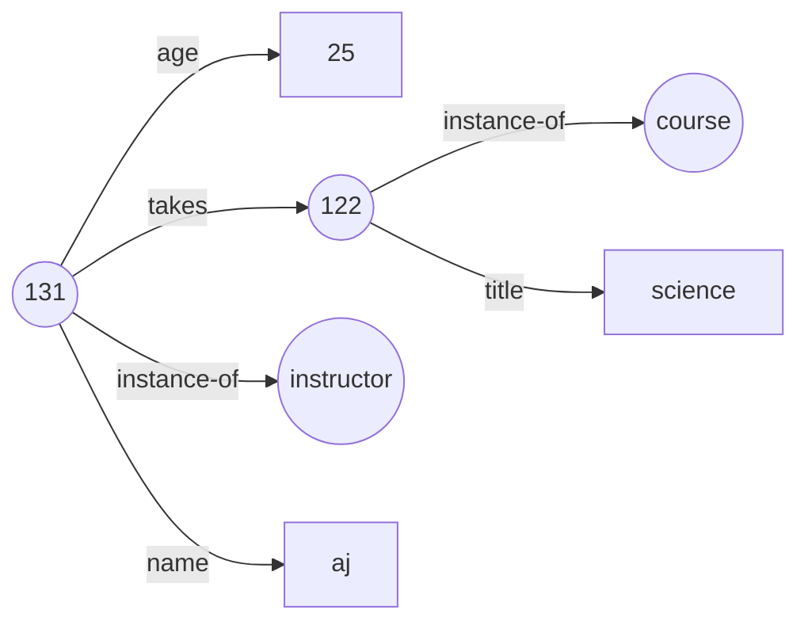

# Introduction

- One of the key requirements of relational data model is that attributes must be atomic: multivalued, composite and complex data types are disallowed.
- But there are applications that need these datatypes to be able to process and access faster.

## Semi-structured data

- 2 needs of semi-structured data:
  - support non-atomic data type storage.
  - data exchange.
- applications that have schema which changes constantly / often.
- Eg: user profile with interests attribute. interests can be stored as a separate table with normalization / as a set of interests with the user profile. latter is easier to access.
- data exchange is another reason: web applications can use JSON / XML formats to process data.

### Extensions of relational data model

- Flexible schema:
  - Wide column data representation
    - to add attributes as and when needed for different tuples in a relation
  - Spare column data representation
    - to have a fixed but very large number of attributes. use those required and rest as null.
- Multivalued data types
  - store non-atomic values such as arrays, sets, multisets, maps as attribute values
  - arrays are preferred for scientific and monitoring applications.
  - non first normal form -> NFNF for supporting multivalued attribute type
  - array database is a database that provides support for arrays
  - Eg: Oracle GeoRsater, PostGiS for PG
- Nested data types
  - store structured and complex data types in the system using JSON, XML, etc.
  - JSON -> JavaScript Object Notation
  - XML -> eXtensible Markup Language
- Knowledge representation
  - To store extremely large set of data (facts + rules on how to process facts) billions of records for AI to process information -> RDF
  - RDF -> Resource Description Format
  - stored as 3-tuples / graph with objects as nodes and attributes as edges

### JSON

- JavaScript Object Notation
- Stores complex and structured data without needing schema
- Key value pairs
- ```json
  {
    "key": "value",
    "key2": [1, 2, 3]
  }
  ```
- JSON is verbose and takes up more storage space.
- CPU intensive to get required fields
- Compressed representations: BSON (Binary JSON) used for storing JSON (MongoDB)
- JSON can be stored as a datatype in relational tables
- Generate SQL queries to get JSON from relational data & vice versa.

### XML

- eXtensible Markup Language
- Store hierarchical data enclosed between tags
- ```xml
  <course>
    <name>science</name>
    <credits>2</credits>
  </course>
  ```
- XML can be stored in relational tables
- Generate SQL queries to get XML from relational data & vice versa.

### RDF

- Resource Description Framework

#### Triple / 3-tuple representation

- Supports 2 types of forms (3-tuples)
  - (id, attribute-name, value)
  - (id1, relationship, id2)
- (subject, predicate, object) 3 tuple form
- Only supports binary relationships
- ids are identifiers of entities / resources
- all attribute values are put in quotes. all non-attribute values, subject and predicate are not shown in quotes
- ```rdf
  131 instance-of instructor
  131 name "aj" #attributes
  131 age "25"
  122 instance-of course # creating an instance
  122 title "science" #attributes
  131 takes 122 # relationship
  ```

#### Graph representation

- Entities and attribute values can be represented as nodes (entities - ovals, attributes - rectangles)
- Relationships and attribute keys can be represented as edges with labels
- Together they form the knowledge graph


#### SparQL
Query language for RDF
```sparql
select ?name
where {
	?cid title "science"
	?sid course ?cid
	?id takes ?sid
	?id name ?name
}
```
#### Representing N-ary relationships
- Knowledge graphs can be extended to store n-ary relationships by creating a dummy entity that connects all participating entities.
- Eg: Student attended course at 2007
- Student, Course, Year and dummy entity e and connect all with valid relationships.
- Instead of 2007 as attribute we make it an entity
- Process: Reification in RDF. Extra information stored are Qualifiers. 
- Other models allows adding context making it quads instead of triples.

## Object Orientation
- To let programming languages access the DB more efficiently:
	- Build object-relational database system that adds OO features to DBMS
	- Object-Relational Mapping that automatically convert data from OO type system to relational representation (ORM)
	- Build object-oriented database system (supports native OO type system) - many issues

### Object Relational DB
- create user-defined types
- create tables
- type inheritance, table inheritance
- reference types to avoid joins
- `head->name` path expressions can be used in sql queries when references are used.
### ORMs
- ORMs help programming languages write data access / modification to underlying database as methods and ORMs translate it to SQL queries under the hood
- There could be some inefficiencies in query performance, so might write native SQL queries within ORM and pass it along.
- Eg: Hibernate in Java, Django ORM in python

## Textual Data

- textual data: unstructured text information stored in documents.
- information retrieval system, retrieves documents with the desired information based on the keywords in the query and match them in the document.
- Can order the result of the query based on count, relevance, etc.
- Eg: web search engines.

#### Relevance Ranking using TF-IDF
- Information retrieval systems must use some metric (RR) to determine the results of the documents based on a Query.
- **term** is defined as keyword that occurs in query / document.
- Counting the number of occurrences is not a good indicator since length of document is not considered.
- given t, how relevant is the document d:
- so term frequency `TF(d, t) = log(1 + n(d,t)/n(d))`
- number of term occurrences in document -> n(d) and no. of  term occurrences t in document -> n(d, t)
- A query Q may contain multiple keywords / term in the search. Using TF for each of them and adding all the relevance is one way but not suitable.
- so Inverse Document Frequency `IDF(t) = 1 / n(t)`
- n(t) -> number of indexed documents that contain the term t, so we know eg: database is more frequent so less weight to it, while "Name" is less frequent, so more weight to it.
- Relevance of document wrt query $r(d, Q) = \sum_{t \in Q} TF(d,t) * IDF(t)$
- can be extended to allow weights given by the user.
- this is called `TF-IDF` formula
- Some words such as 'a', 'an', etc are not supposed to be indexed -> stop words which are ignored.
- Other factors such as proximity of terms can also be considered.
#### RR using Hyperlinks
- Hyperlinks between documents can decide the overall importance of a document independent of keyword query.
- Page Rank algorithm developed by Google is used to calculate the popularity of a web page based on the number of pages that link to that page.
- Page Rank -> number of links that connect to the web page + page rank of those web pages that have those links which connect to the current web page.
- PR of document d = PR of all documents that contain the link to document d.
- $P[j] = \delta / N + (1 - \delta) / N * \sum_{i=1}^{N} (T[i,j] * P[i])$
- $\delta$ is a constant between 0 & 1 set to 0.15 usually
- where $T[i, j] = 1/Ni$ where Ni is number of links out of page i which gives T[i, j] a probability
- there are i web pages and each have Ni links for j. to find out P[j] -> use P[i] * T[i, j] for all the wbe pages i = 1 to N + some constant
- PR is a static measure, which can be combined with TF-IDF scores to judge relevance of a document to the term in the query.
- Number of factors such as PR, TF-IDF, proximity, weights, how often a site is visited, etc. and much more can be used to compute the relevance of a document to the given query.
### Measuring Retrieval Effectiveness
- Using precision and recall
- **precision**: what % of the documents are relevant to the query. Say out of 10 retrieved, how many of them are relevant to the query.
- **recall**: what % of the documents that are retrieved compared to the total relevant documents. Say out of 10 available documents, how many of them retrieved are relevant to the query.
#### Keyword Querying
- Keyword querying can be extended from documents (textual data - unstructured) to structured and semi-structured data using Knowledge graphs
- Web search engines use knowledge graphs + crawled documents to answer user queries.

## Spatial Data
- Spatial data are those for storing spatial locations such as longitude, elevation, geometrical figures, etc.
- 2 types of spatial data:
	- Geographic data involves road maps, topography, etc. Based on round-earth coordinate system storing Latitude, Longitude and Elevation
	- Geometric data involves buildings, cars are constructed. 2d / 3d Euclidean space with X,Y,Z coordinates.
- Open Geospatial Consortium (OGC) standard for representing spatial data.

### Geometrical Data
- Line Segments, Triangles, 2d figures can be stored as a list of points (x, y) in 2d and (x,y,z) in 3d.
- Polygons can also be stored as a list of triangles that make up polygon.
- Curves can be stored as their types or approximate polygons
- there are geometry and geography types in some database systems.
- Spatial network or Spatial graph stores information about locations as nodes and extra information such as distance, avg lane speed, etc. as edges between those nodes.
#### CAD
- Computer Aided Design used in designing complex 2d / 3d structures.
- Traditionally store data in memory and write it to the file at the end of editing and reload it next time.
- For large designs it may be impossible as memory won't fix all the design components
- Objects are later stored as simpler 2d / 3d shapes such as square, rectangle and later perform a union, intersect, operations for the required end product object.
- Design databases can also store non-spatial information such as color, material, etc.
- Spatial index structures are useful for performing various spatial operations such as union, difference, etc.
- Spatial integrity constraints can also be put which is very useful.

### Geographic data
- eg: storing locations, navigations, number of houses, public information etc.

#### Representation
- two types of geographic data representation:
	- raster data: stores data in bitmaps / pixel maps. represented as tiles
	- vector data: stores data in geometric objects such as lines, polygons, etc.
#### Spatial Queries
- region queries: object that lie fully inside, partially, etc.
- nearness queries: objects near to some object
- spatial graph queries: distance between 2 locations.