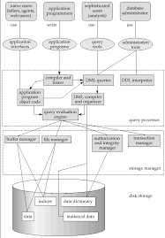

# Introduction to DBMS

- A **DBMS - Database Management Systems** is a collection of interrelated data and a set of programs to manage those data.
- Collection of data: **Database**
- Store and retrieve db information both conveniently and efficiently.
- There are 2 modes in which DBMS are used:
  - **OLTP**:
    - OnLine Transaction Processing
    - When large number of users use DB to perform small amounts of reads and writes
  - **OLAP**:
    - OnLine Analytical Processing
    - When business users / analysts use DB to draw conclusions from a very large set of data.

## Why DBMS?

- Alternative is to store in files provided by OS and perform reads / writes.
- **File-based processing system**
- Issues:
  - Data redundancy
  - Data inconsistency
  - Difficulty to access derivations of data involving 2 or more files
  - Data isolation
    - files could be in different formats / different application programs to retrieve it
  - Integrity constraints:
    - satisfy certain consistency constraints such as value > 0, must be string, etc.
  - Atomicity problems:
    - some files are updated / some not - cause issue. should not exist
    - atomic: entirely happen or not happen at all
  - Concurrent-access anomalies:
    - if one file is used by 2 users at different steps, both must be consistent before and after update.
  - Security:
    - Difficult to implement RBAC

## Data Models

- A **data model** is a collection of conceptual tools to describe data, semantics, relationship, consistency constraints.
- 4 broad categories:
  - relational data model
    - collection of tables to represent data and relationship among data.
    - each table has multiple columns called attributes
    - each row is called a tuple
    - each table is also called as relation
    - each record in a table corresponds to fixed-record type. even some attributes don't have value for a row, we have some space allocated for it in the physical storage.
  - ER model:
    - collection of basic objects (entities) and relationship among these objects.
  - Semi-structured data:
    - permits individual data can have varied attributes. eg: student has grade and not salary, while instructor has salary and not grade attribute.
    - Eg: XML, JSON data types
  - Object-based data model:
    - Standards exist to store objects of programming languages into relational tables.
    - Procedures to be stored in system and be executed by the system.

## Database Abstraction

- Several layers exist is the database based on the level of information required.
- **Physical layer**
  - lowest level
  - how data is stored
  - concerns with blocks of data, indexing, data structure used, etc.
- **Logical layer**
  - how data is structured
  - concerns with data model, data relationships, etc.
- **View layer**
  - highest level
  - how data is presented to the user
  - concerns with data presentation, data security, etc.

## Instances and Schemas

- **Schema**: Overall design of the database. It is a blueprint of the database.
- **Instance**: Actual data stored in the database at a given time.
- 3 levels of schema:
  - Physical schema
  - Logical schema -> most important for application development PoV
  - View schema also can be divided into subschemas

## Database Languages

- DDL to specify schema, storage, access, etc.
- DML to express DB queries, updates, etc.
- They both form a part of Query Language called **SQL**: Structured Query Language
- **DDL**: (Data Storage & Definition Language)
  - specify storage structure
  - access methods
  - Constraints that must be satisfied everytime data is inserted: eg: value > 0, must be string, etc.
  - these are called integrity constraints.
  - Provides:
    - Domain Constraints: values must be of certain domain, eg: string, int, etc.
    - Referential Integrity: values must be present in another table.
    - Authorization: who can access the data. (read, insert, update, delete, all, combination of those auth)
  - output of DDL is stored in Data Dictionary, which contains the metadata - data about the data.
  - DD is a special type of table only accesible by system admins. DBMS consults the DD before performing any queries.
- **DML**: (Data Manipulation Language)
  - Retrieve data from DB
  - Update data in DB
  - Insert data into DB
  - Delete data from DB
  - Two types of DML:
    - Procedural DML:
      - specify what and how data is needed.
    - Declarative DML:
      - specify what data is needed.
  - Query is a statement requesting retrieval of data from DB.
  - Portion of DML that deals with information retrieval is called Query Language.
  - levels of abstractions are also applicable for manipulating data:
    - at physical level: algorithms for efficient data access
    - at higher levels: ease of use.
  - Query Processor translates incoming SQL to sequences of actions at physical level.
  - SQL is nonprocedural and takes in multiple tables but always returns a single table.
  - SQL is not as powerful as universal Turing machine. Some computations such as output to display, take user input are not possible, communication over network not possible. So these actions must be written in a host language eg: Java. Application programs use an API such as JDBC / ODBC to embed these SQL statements within the application program and communicate with the DB.

## Database Design

- design of the database system
- different phases:
  - get requirement from the users
  - chose a data model: conceptual design and design the requirements (either use ER model or Normalization)
  - ensure design meets functional requirements.
  - translate ER model to logical design with relations, columns, etc.
  - generate physical level details such as storage, indexing, etc.

## Database Engine

- Database Engine is the core component of the DBMS.
- Divided into 3 core parts:
  - Storage Manager
  - Transaction Manager
  - Query Processor

### Storage Manager

- DB typically requires large amounts of storage space.
- Main memory can't store huge amount of information and can be lost when system crash / failures - need to persisted to disk.
- Data are moved between main memory and disk as needed.
- Structure data to efficiently transfer data between main memory and disk.
- Responsible for interaction with the OS's file system.
- translate DML statements into low-level file commands.
- responsible for storing, retrieving and updating data in the DB.
- Components:
  - Authorization and integrity manager: tests integrity constraints and auth checks on who can access.
  - Transaction manager: ensures DB remaing consistent even in the event of crashes / system failures and concurrent transactions happen without conflicts.
  - Buffer manager: fetch data from disk and into main memory and decide what data to cache in main memory.
  - File manager: allocation of disk storage and data structures to represent data.
- Data structures implemented:
  - Data files: store the database
  - Data Dictionary: metadata about the database
  - Indices: fast and efficient access to data.

### Query Processor

- Translate incoming instructions into efficient and fast sequences of actions at physical level.
- Components:
  - DDL interpreter: interprets DDL statements and stores it in the DD
  - DML compiler: translates DML statements into an evaluation plan that query-evaluation engine can understand. Also picks up the lowest-cost plan among the possible plans. (Query optimization)
  - Query evaluation engine: executes low-level instructions generated by the DML compiler.

### Transaction Manager

- allows application developers to treat sequence of operations on a database a single unit of work that either happens in its entirety or not at all.
- Transaction: Collection of operations that performs a single logical function in database. Eg: transfer money from one account to another. 3 operations: update balance of account 1, update balance of account 2, update transaction history.
- Components:
  - recovery manager: ensures atomicity and durability properties. if system crash / failure, responsibility of DB to handle it. Perform failure recovery.
  - concurrency manager: ensures isolation and consistency properties. Prevents concurrent transactions from conflicting with each other.

## Database & Application Architecture

- shared-memory architecture
- parallel databases run on cluster of multiple machines
- distributed databases multiple geographically separated machines.

## Database Users

- Naive Users
- Application Programmers
- Sophisticated Users
- Database Administrator
