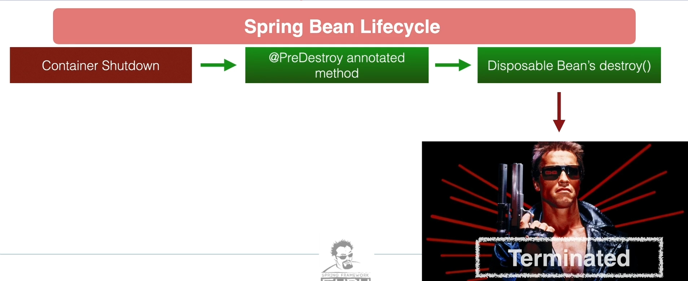

# Secion 3 - Dependency Injection

- SOLID principles
- ApplicationContext is returned when Spring performs a scan on all the annotated components
- To access the component -> `ctx.getBean(MyComponent.class)`
- `@Autowired` to inject the required component
- Dependency Injection is where a needed Dependency is injected by another object.
- Ask for what you need, and get them.
- Types of DI:
  - by class properties (least preferred)
    - both private and public. private avoid
  - by setters (mid)
  - by constructors (most preferred)
- DI:
  - by class (avoid) tight coupling
  - by interface
- Inversion of control
  - allow framework to compose application by controlling which implementation should be injected
  - eg: h2 for local and mysql for production
- DI vs IoC
  - DI is about writing code
  - IoC is runtime environment of code. Control of DI is given to the framework. Spring is in control of injection of dependencies.
- Best practices:
  - constructor injection over setter injection
  - private final for DI properties
  - code to interface
- without DI

```java
class Service {
    getHello() {}
}

class Controller {
    private final Service service;
    public constructor() {
        service = new Service(); // object creation is taken up by clients implementing dependencies.
    }
}
```

- with DI

```java
@Service
class Service {
    getHello() {}
}

@Controller
class Controller {
    private final Service service;
    public constructor(Service svc) {
        service = svc; // spring will autowire the dependency.
    }

    // Property injection
    // @Autowired
    // private Service service;

    // Setter Injection

    // @Autowired
    // private setService(Service svc) {
        // service = svc;
    // }
}
```

- if multiple beans are there, set `@Primary` for the primary bean
- to use other beans, `@Qualifier('beanName')` for other beans
- control which beans with same qualifier to use using spring profiles
- Mention `@Profile('name')` on the beans and with the profile -> `@ActiveProfile('name')`
- To set default profile -> `@Profile({"name", "default"})`

## Spring bean lifecycle




14 Aware interfaces
