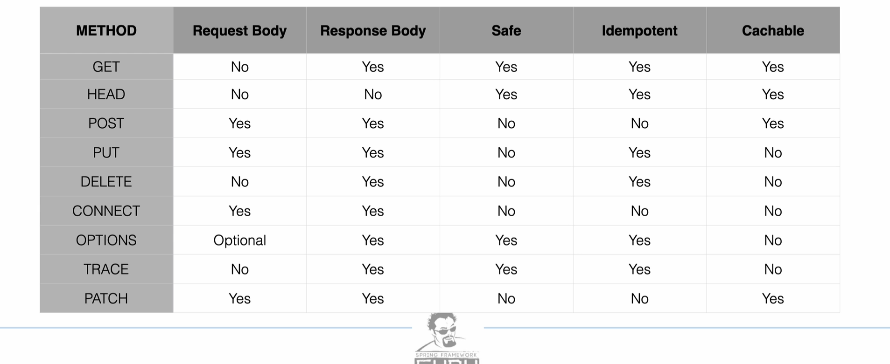
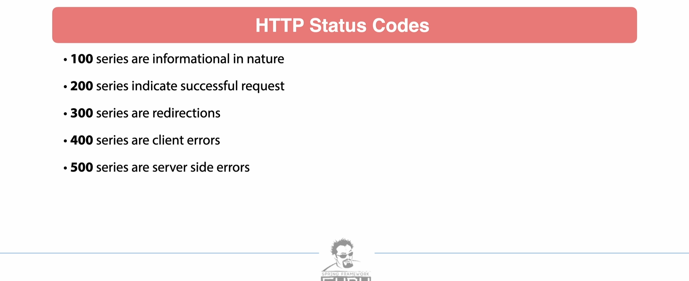
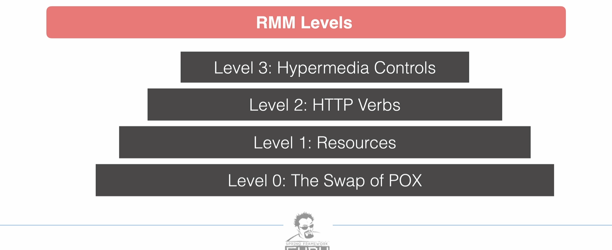

# HTTP

## Terminologies

- REST
- Idempotence
- Stateless (doesn't maintain client state)
- HATEOAS (Hypermedia as the Engine of Application State)
- Safe methods - GET, HEAD, etc.
- Richardson's maturity model (RMM)

- POX -> Implementing protocol as transport protocol (RPC, SOAP). One URI to identify a resource
- Resources -> Multiple URI to identify resources
- HTTP Verbs with URIs for desired actions
- Representation contain URIs which may be useful to consumers (discoverability)

## With spring

- 3 distinct web frameworks for Restful web services
- 2 distinct web clients for consuming Restful web services

### Web Framework

- Spring MVC
  - blocking, non-reactive
  - commonly used
  - compatible with Jakarta EE
  - Java servlet API
- Spring WebFlux
  - uses project Reactor
  - No Java Servlet API => Non-blocking
  - reactive web serivces
- WebFlux.fn
  - Functional programming model
  - alternative to annotations based

### Client

- Spring RestTemplate
  - non-reactive, blocking
- Spring WebClient
  - Reactor Netty, non-blocking HTTP client library
  - reactive web client

### Marshalling & Unmarshalling

- Pojo -> Json/XML => Marshalling
- Reverse => Unmarshalling
- Jackson to marshal and unmarshal
- other libraries exist too

### Combine with SPA

- Spring for restful APIs and SPA using Angular, React
