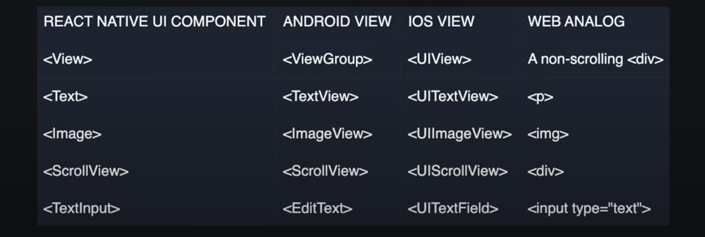

# React Native

- React Native is an open source framework for building native Android and iOS applications
- JS to access platform specific APIs
- react-dom for the web, react-native for the mobile
- Android requires java / kotlin and iOS requires Swift / Objective-c

## Expo vs React native

- RN is maintained by Meta, Expo maintained by Expo (like Next on top of React)
- RN can't be built from windows or linux to run iOS apps, Expo helps you building

## Project Structure

- package.json for dependencies
- package-lock.json for consistent dependencies
- babel.config.js for babel-preset-expo for decorators, babel plugins, presets, etc
- app.json for app configurations such as metadata
- App.js default screen for project
- .gitignore
- node_modules/
- assets/ for icons, images, etc.

## Running Expo App

- iOS device
- Android device
- iOS simulator
- Android simulator
- Run in iOS using Expo GO

## Core Components

- React for web uses div, span, paragraph, etc.
- is mobile -> view is a rectangular element on the screen that can display text, images, videos, user input, etc
- RN can creates views at run time from JS
- 
- import View, Text, etc for react-native unlike div, span in react-dom

### View

- View is equivalent to non-scrolling div
- import {View} from 'react-native'
- default export a function App
-
